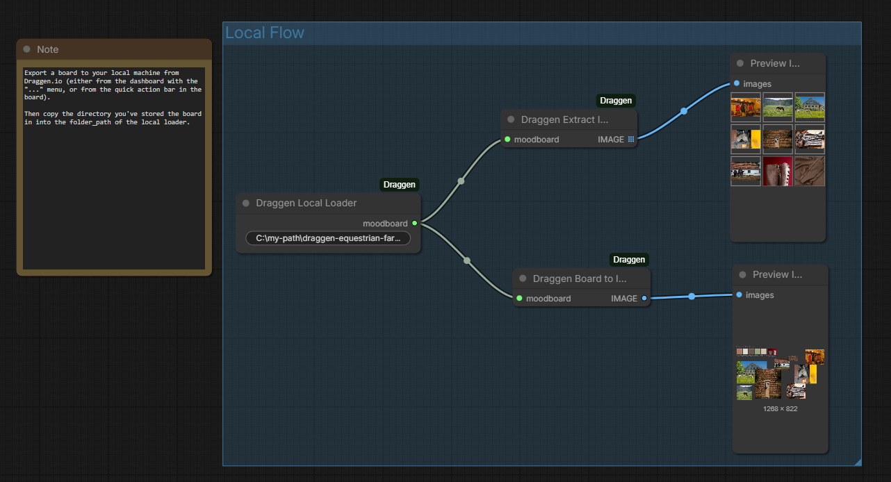

# ComfyUI-Draggen

A set of ComfyUI nodes to integrate with [Draggen.io](https://draggen.io), allowing you to load moodboards from the Draggen API or local storage and use them in your generative workflows.

## Features

- **Remote Loader:** Fetch moodboards directly from Draggen.io using your API Key [Subscription required].
- **Local Loader:** Load moodboards exported to your local machine [Free].
- **Board to Image:** Render the moodboard as a composite image, respecting element positioning and z-index.
- **Image Extractor:** Extract individual images from the moodboard for batch processing.
- **Text Extractor:** Extract text descriptions/prompts from the moodboard.

## Installation

1.  Clone this repository into your `ComfyUI/custom_nodes/` directory:
    ```bash
    cd ComfyUI/custom_nodes/
    git clone https://github.com/yourusername/ComfyUI-Draggen.git
    ```
2.  Restart ComfyUI.

## Usage

### Remote Loading
1.  Add the **Draggen Remote Loader** node.
2.  Enter your **Moodboard ID** (found in the Draggen URL) or use the **Load Boards** button to browse.
3.  Enter your **API Key** (Open the account tab here: https://draggen.io/dashboard).


### Local Loading
1.  Add the **Draggen Local Loader** node.
2.  Enter the absolute path to the folder containing your moodboard (`data.json` file and `images/` subfolder).



### Processing
- Connect the `DRAGGEN_MOODBOARD` output to **Draggen Board to Image** to get a rendered view.
- Connect to **Draggen Extract Images** to get a batch of source images.
- Connect to **Draggen Extract Text** to get the text content.

## Example Workflow

An example workflow is available in the `example` folder. You can load `example/basic.json` into ComfyUI to see a basic setup using these nodes.

## License

MIT
